# Checklist

- 인터넷은 어떻게 동작하나요? OSI 7 Layer에 입각하여 설명해 보세요.
- 우리가 브라우저의 주소 창에 [www.knowre.com](http://www.knowre.com/) 을 쳤을 때, 어떤 과정을 통해 노리의 서버 주소를 알게 되나요?

# Quest

- tracert(Windows가 아닌 경우 traceroute) 명령을 통해 [www.google.com](http://www.google.com/) 까지 가는 경로를 찾아 보세요.
    - 어떤 IP주소들이 있나요?
    - 그 IP주소들은 어디에 위치해 있나요?
- Wireshark를 통해 [www.google.com](http://www.google.com/) 으로 요청을 날렸을 떄 어떤 TCP 패킷이 오가는지 확인해 보세요
    - TCP 패킷을 주고받는 과정은 어떻게 되나요?
    - 각각의 패킷에 어떤 정보들이 담겨 있나요?
- telnet 명령을 통해 [http://www.google.com/](http://www.google.com/) URL에 HTTP 요청을 날려 보세요.
    - 어떤 헤더들이 있나요?
    - 그 헤더들은 어떤 역할을 하나요?

# Answers

> 인터넷은 어떻게 동작하나요? OSI 7 Layer에 입각하여 설명해 보세요.


### Physical Layer (물리 계층)

먼저 **물리계층**에 해당하는 허브를 통해 `플로딩(Flooding)` 작업을 해줘야 합니다. 이는 브로드캐스트의 성질과 유사한데, 어떤 PC의 데이터가 허브로 보내졌다면, 허브에서는 허브에 포함된 모든 PC들에게 모두 데이터를 보내줍니다. 이는 빠른 송신을 위해서인데, 허브에서 목적지에 대한 조사나 원하는 곳으로만 데이터를 전달하게 되면 허브의 작업비용은 매우 높습니다.

전달받은 PC에서는자신에게 온 데이터라면 이를 받아들이고, 아니면 그냥 무시합니다.

또한 물리 계층에서는 물리적 전기 신호가 목적지까지 안전하게 갈 수 있도록 `리피터(Repeater)` 역할도 수행하게 됩니다. 이 리피터도 역시 플로딩 작업을 통해 작동하기 때문에 하나의 리피터에 연결된 모든 장비는 같은 데이터를 듣게 됩니다.

전송 단위 - bit

대표 장치 - Hub

### Data Link Layer (데이터 링크 계층)

물리 계층(허브)에서 전기 신호를 플로딩으로 전송하였고, 수신자 측에서는  자신의 데이터가 맞다면 해당 데이터를 받아들일지 말지 판단해야 합니다. 이 판단을 수행하는 계층이 바로 **데이터 링크 계층**입니다. 물리 계층에서는 신호의 내용을 전혀 확인하지 않습니다. 하지만 데이터 링크에서는 앞서 온 신호를 Frame으로 변환할 수 있습니다.

이 Frame 에는 `MAC Address` 라는 고유한 주소가 존재합니다. 이 주소는 무조건 유일해야 합니다. 컴퓨터를 사거나 서버를 구매하게 되는 일이 생기면 공유 네트워크 카드가 존재합니다. 이 네트워크 카드가 가지고 있는 물리적 주소가 바로 `MAC Address` 입니다.

데이터 링크 계층에서는 `MAC Address`를 통해 주소 할당을 해주어야 합니다. 물리 계층에서 온 신호를 우리가 원하는 `MAC Address` 에 제대로 전달 해 줄 수 있어야 데이터 링크 계층의 역할을 한 것입니다. 이 기능을 수행하는 대표적인 장치가 `스위치(Switch)` 입니다.

또한 데이터 링크 계층은 물리 계층에서 발생한 오류를 감지할 수 있어야 합니다. 물리 계층에서는 신호 내용에 대한 체크를 하지 않으므로, 신호 증폭에 실패하여 데이터를 받지 못하게 된다해도 이를 알 방법이 없습니다. 그렇기에 물리 계층에서 데이터의 오류가 발생한다면 이를 데이터 링크 계층에서 알아차리고 `MAC Address` 에 써있는 주소에게 말해 데이터를 다시 보내라고 요청해야 합니다.

전송 단위 - Frame

대표 장치 - L2 Switch, 브릿지

프로토콜 - 이더넷, MAC, PPP, LAN, WiFi

### Network Layer (네트워크 계층)

이더넷을 통해 인터넷에 들어온 곳이 출발점 이라면, 목적지 네트워크까지 어떤 노드를 거쳐 어떻게 도달할지 정해야 합니다. 이 흐름 제어 역할을 하는 장비가 바로 `라우터(Router)` 입니다. 이 라우터에 도달한 정보들을 라우터가 정해주는 방향으로 움직이게 됩니다.

라우터가 하는 라우팅을 위해 모든 네트워크 접속자는 주소를 가지고 있어야 합니다. 이 주소가 바로 `IP Address` 입니다.

**네트워크 계층**에서 수행하는 작업들은 다음과 같습니다.

- 라우팅 : 라우팅 테이블을 통해 Packet의 다음 경로를 어디로 할지 정해주는 작업
- 포워딩 : 라우팅 작업을 통해 결정 된 경로로 데이터를 Packet구조로 만들어 다음 라우터로 Packet으로 전달하는 작업

네트워크 계층에서는 데이터 링크 계층에서 받은 Frame을 Packet으로 관리합니다. 데이터 링크 계층에서 MAC을 보고 데이터를 전달하고 수신 받았다면, 다음 라우팅의 목적지를 위한 MAC주소가 중요합니다. 여기서 새로운 Packet을 만들어 내야 하는데, Frame을 Packet으로 나누고 IP주소를 확인합니다. 라우터의 라우팅 테이블은 IP주소에 따라 어떤 MAC주소를 부여해야 할 지가 정의 되어 있습니다. 이렇게 만들어진 새로운 Packet을 네트워크 가드애 전해주는 것이 네트워크 계층의역할 입니다.

전송 단위 - Packet

대표 장치 - Router

프로토콜 : IP, ICMP 등

### Transport Layer (전송 계층)

**전송 계층**의 주 목적은  양 끝에 있는 두 사용자간에 데이터를 정확하게 전달할 수 있는가? 입니다.

네트워크 계층에서 전송한 Packet이 IP주소를 통해 원하는 네트워크에 도달 했다면, Packet에서 IP부분을 제외한 Segment의 적합성을 봐야 합니다. 즉, 전송 계층에서의 데이터 단위는 '세그먼트(Segment)' 입니다.

과거의 송신은 '회선 교환' 방식이였습니다. 이 방식에서는 굳이 전송 계층이 필요하지 않았습니다. 왜냐하면 회선 교환 방식에서는 데이터 전송을 원하는 두 지점의 회선 경로가 미리 정해진 방식이였고, 데이터가 중간에 바뀔 염려는 없었습니다. 하지만 해당 회선(경로)에 문제가 생기면 데이터를 주고받지 못하는 문제가 생겼습니다.

현대의 송신은 '패킷 교환' 으로 전부 바뀌었습니다. 경로가 정해지지 않은채로 데이터를 전송하면 네트워크 환경 안에서 임의의 경로에 따라 움직이게 되었습니다. 일부 회선이 손상 되더라도 데이터가 송신된다는 장점은 있었지만, Packet의 정확성이 문제였습니다. 이러한 문제를 해결하기 위해 생겨난 프로토콜이 **TCP(Transport Control Protocol)**와 **UDP(User Datagram Protocol)**입니다.

TCP는 `Three Way Handshake` 로 이를 정의합니다.

1. 내가 통신을 원하는 대상에게 통신을 원한다는 메세지를 보낸다. (SYN)
2. SYN을 받은 대상이 통신 준비가 되었다는 정보를 송신자에게 보낸다. (SYN-ACK)
3. SYN-ACK 를 잘 받았다고 다시 한번 수신자에게 확인을 한다. (ACK)

이렇게 두 네트워크가 연결이 되었다면 데이터를 서로 주고 받으며 정확성이 보장된 데이터를 주고 받게 됩니다. 이러한 정확성 보장은 TCP의 가장 큰 특징이기도 합니다. TCP에서는 내가 보낸 데이터가 얼마나 전송 되었고, 어느 부분이 누락 되었는지 까지 판단해 양자간의 정확한 전송이 보장됩니다.

반면에 UDP는 조금 다릅니다. UDP는 신뢰성 보다는 **신속함**에 초점이 맞춰져 있습니다. 앞서 설명한 과정 다 필요없이 그냥 IP주소보고 데이터를 마구잡이로 보내는 과정입니다. 이는 굉장히 쓸모없어 보이지만 미디어 전송에서 빛을 발합니다. 헤더의 길이가 TCP에 비해 월등히 짧기 때문에(UDP 헤더 : 목적지 주소와 실데이터) 데이터 누락이 발생 되었는지 눈치도 못 챌 정도로 잘 보여주게 됩니다.

전송 단위 - Segment(세그먼트)

대표 장치 - L4 Switch, 게이트웨이

프로토콜 - TCP, UDP, ARP

### Session Layer (세션 계층)

앞서 전송 계층을 통해 두 네트워크간의 연결이 성립되었다면, 우리는 이를 네트워크 세션이 생성되었다고 표현합니다. 만약 TCP로 연결이 성립되면 TCP세션이라고 합니다. 형성된 세션간의 데이터 송수신을 어떻게 관리 할지에 대해 정의해야 하는데 이것이 **세션 계층에서의 역할**입니다. 한번 연결된 세션에서 향후 표현 계층과 응용 계층에서 어떻게 사용자에게 정보를 보여줄 것인지, 형성된 세션이 끊기지 않도록 어떻게 관리할 것인지 정의하는 것이 세션 계층의 역할입니다.

세션 계층에서는 TCP/IP 세션을 만들고 없애는 책임을 집니다. 통신하는 사용자들을 동기화하고 오류복구 명령들을 일괄적으로 다룹니다.

세션 계층의 역할은 아래와 같습니다.

- 세션 설정 및 해제 방법 정의 (인증 및 허가도 포함)
- 세션 다중화  / 단일화 : 통신 효율을 위해 세션을 다중화 할지 단일화 할지 결정
- 송수신 방식(duplex), 반이중 방식(half-duplex), 전이중 방식(Full Duplex) 결정
- 세션 회복

운영체제 실습을 해본적이 있는 사람이라면, 리눅스를 사용할 때 원격 접속을 위해 SSH를 사용하게 되는데, SSH가 세션계층에서 작동하는 대표적인 프로토콜입니다.

전송 단위 - Data

대표 장치 - L5 Switch

프로토콜 - NetBIOS, SSH, TLS

### Presentation Layer (표현 계층)

**표현 계층**에서는 전달 받은 네트워크 메시지를 사용자가 볼 수 있도록 만드는 기능을 합니다. 지금까지 누군가가 보낸 메시지를 Frame, Packet, Segment로 포장해서 전달했다면, 이 포장지를 뜯어서 사용자에게 전달하는 기능이 표현 계층의 역할입니다.

표현 계층에서 진행하는 3가지 기능은 아래와 같습니다.

- 수신자 장치(노트북, 스마트폰 등)에 적합한 어플리케이션으로 노출 시킬 수 있도록 데이터를 해석
- 수신자에서 압축을 풀 수 있는 방식으로 된 데이터 압축
- 데이터 암호화 / 복호화

표현 계층에서는 우리가 응용 계층에서 메시지를 볼 수 있도록 진행하는 사전 작업이자, 네트워크 환경으로 데이터를 넘기기 위해 진행하는 사전 작업으로 볼 수 있습니다. 대표적으로 `MIME(Multipurpose Internet Mail Extensions)` 가 표현 계층에서 작동합니다.

프로토콜 - JPG, MPEG, SMB

### Application Layer (응용 계층)

**응용 계층**은 우리에게 친숙합니다. 네트워크 기능을 작동하는 모든 프로그램들은 응용 계층에서 작동합니다. 우리가 쓰고 있는 크롬, 사파리 등 웹 브라우저는 물론이고, 인터넷에 글을 올리는 행위, 멀티 게임을 하기 위해 접속하는 행위 모든 것이 응용 계층입니다. 간단히 표현하면, 우리가 네트워크로 접속하기 위한 사용자 인터페이스를 의미합니다.

응용 계층에는 많은 프로토콜이 존재합니다. 아래는 대표적인 응용 계층의 프로토콜 입니다.

- 텔넷(TELNET) : 원격지의 호스트 컴퓨터에 접속하기 위해 사용하는 인터넷 프로토콜
- DNS(Domain Name System) : 호스트의 도메인 이름을 호스트의 네트워크 주소로 바꾸거나 반대의 변환을 수행하는 프로토콜
- FTP(File Transfer Protocol) : 서버/클라이언트 사이의 파일 전송을 위한 프로토콜
- HTTP(Hyper Text Transfer Protocol) : WWW 상에서 정보를 주고받을 수 있는 프로토콜, HTML 문서를 주고 받는 역할 등
- SMTP(Simple Mail Transfer Protocol) : 인터넷에서 이메일을 보내기 위해 사용하는 프로토콜

## 인터넷 동작 원리?

### Physical Layer

각 PC는 연결될 준비가 되어야 합니다. 각 컴퓨터의 허브에 포트를 연결합니다. 허브에 연결된 포트는 Flooding 작업을 통하여 신호가 들어온 포트를 제외한 모든 포트에 신호를 전달합니다.

### Data Link Layer

허브를 통해 들어온 신호를 프레임으로 필터링하고, MAC Address를 이용하여 데이터를 보내고자 하는 포트에만 신호를 전달합니다.

### Network Layer

허브, 스위치를 이용하여 LAN을 구성한 후에 외부와 연결하기 위해서는 라우터가 필요합니다. 라우터는 라우팅이라는 과정을 통해 한 네트워크에서 다른 네트워크로 패킷을 전달하기 위해 사용합니다. Network Layer에서는 IP주소를 사용해서 전달합니다.

### Transport Layer

네트워크 계층에서 전송한 패킷이 IP주소를 통해 원하는 네트워크에 도달했다면, 패킷에서 IP 부분을 제외하고 Segment의 적합성을 봅니다. TCP프로토콜 - 3 Way Hand Shake를 통해 서로간 연결을 확인하고, 데이터를 주고받을 준비를 합니다.

### Session Layer

위에서 TCP로 연결이 되었으니 TCP 세션이 생성됩니다. 세션 계층에선 한번 연결된 세션에서 향후 표현 계층과 응용 계층에서 어떻게 사용자에게 정보를 보여줄 것인지, 형성된 세션이 끊기지 않도록 어떻게 관리할 것인지 정의합니다.

### Presentation Layer

표현 계층에서는 위 계층에서 전달받은 데이터를 사용자에게 전달해야 합니다. 수신자 장치에 맟게 데이터를 해석하고 압축합니다.

### Application Layer

이제 사용자에게 보여줄 일만 남았습니다. 브라우저, 모바일 앱 등 사용자에게 닿는 모든 행위는 응용 계층입니다.

---

> 우리가 브라우저의 주소 창에 [www.knowre.com](http://www.knowre.com/) 을 쳤을 때, 어떤 과정을 통해 노리의 서버 주소를 알게 되나요?

1. PC 브라우저에서 [www.knowre.com](http://www.knowre.com) 을 입력합니다.
2. PC는 미리 설정되어 있는 DNS(Local DNS)에게 "www.knowre.com"이라는 hostname에 대한 IP주소를 물어봅니다.
3. Local DNS에는 "www.knowre.com"에 대한 캐싱되어 있지 않다고 가정하겠습니다.
4. Local DNS는 "www.knowre.com"에 대한 IP주소를 찾아내기 위해 다른 DNS 서버들과 통신(DNS Message)을 시작합니다. 먼저 Root DNS 서버에게 "www.knowre.com"에 대한 IP주소를 아는지에 대해 질의합니다.
5. Local DNS가 Root DNS에 질의하기 위해  각 Local DNS 서버에는 Root DNS 서버의 정보 (IP Address)가 미리 설정되어 있어야 합니다.
6. Root DNS 서버는 "www.knowre.com"에 대해 모릅니다. 그래서 .com 도메인이기 때문에 Local DNS 서버에게 com Domain을 관리하는(TLD) DNS서버의 정보를 포함하여 응답합니다.
7. Local DNS 서버는 "com Domain"을 관리하는 DNS 서버에게 "www.knowre.com"에 대한 IP 주소를 아는지에 대해 질의합니다.
8. "com Domain"을 관리하는 DNS 서버또한 해당 정보가 없습니다. 그래서 Local DNS 서버에게 "knowre.com" 도메인을 관리하는 DNS서버의 정보를 포함하여 응답합니다.
9. Local DNS 서버는 "knowre.com" 도메인을 관리하는 DNS 서버에게 "www.knowre.com"에 대한 IP주소를 질의합니다.
10. 이 DNS 서버는 [knowre.com](http://knowre.com) 도메인을 직접 매니징하고 있으므로 해당 IP 주소를 반환할 수 있게 됩니다.
11. 이를 수신한 Local DNS는 [www.knowre.com](http://www.knowre.com) 에 대한 IP주소를 캐싱하고 단말(PC)에 전달해 줍니다.

이와 같이 Local DNS 서버가 여러 DNS 서버를 차례대로 (Root DNS → com DNS → [knowre.com](http://knowre.com) DNS)물어봐서 그 답을 **Recursive Query**라고 부릅니다.

---

> tracert(Windows가 아닌 경우 traceroute) 명령을 통해 [www.google.com](http://www.google.com/) 까지 가는 경로를 찾아 보세요.

- 어떤 IP주소들이 있나요?
- 그 IP주소들은 어디에 위치해 있나요?

```
// 공유기 IP
1  
192.168.219.1 (192.168.219.1)  3.218 ms  1.777 ms  2.123 ms

// LG POWERCOM - 서울
2  
49.171.95.129 (49.171.95.129)  7.447 ms  7.054 ms  8.508 ms

// Fail
3  
10.203.29.129 (10.203.29.129)  4.308 ms  4.998 ms  5.740 ms

// LG DACOM - 용산
4  
1.213.20.205 (1.213.20.205)  4.592 ms
1.208.20.221 (1.208.20.221)  3.657 ms   
1.213.20.1 (1.213.20.1)  3.395 ms

// LG DACOM - 용산
5  
1.208.167.133 (1.208.167.133)  7.940 ms
1.213.152.177 (1.213.152.177)  4.923 ms
1.208.167.133 (1.208.167.133)  7.280 ms

// LG DACOM - 용산
6  
1.213.107.253 (1.213.107.253)  4.250 ms
61.42.202.129 (61.42.202.129)  4.493 ms
1.208.145.18 (1.208.145.18)  5.799 ms

// LG DACOM - 용산
7  
1.208.167.105 (1.208.167.105)  3.886 ms
1.208.174.29 (1.208.174.29)  4.912 ms
1.208.145.189 (1.208.145.189)  4.835 ms

// LG DACOM - 용산
8  
1.208.0.74 (1.208.0.74)  50.289 ms
164.124.250.202 (164.124.250.202)  49.542 ms
203.252.13.22 (203.252.13.22)  39.177 ms

// LG DACOM - 용산
9  
1.208.106.106 (1.208.106.106)  40.203 ms
1.208.150.182 (1.208.150.182)  38.743 ms
1.208.148.206 (1.208.148.206)  46.546 ms

// Google LLC - United States
10  
74.125.118.154 (74.125.118.154)  47.885 ms
72.14.215.29 (72.14.215.29)  50.765 ms
74.125.118.154 (74.125.118.154)  40.901 ms

// Fail
11  * 10.252.54.126 (10.252.54.126)  56.955 ms *

// Google LLC - Canada
12  
108.170.241.33 (108.170.241.33)  41.817 ms
108.170.241.97 (108.170.241.97)  52.353 ms
72.14.234.62 (72.14.234.62)  49.768 ms

// Google LLC - Canada
13  
108.170.241.79 (108.170.241.79)  43.670 ms
108.170.241.48 (108.170.241.48)  57.734 ms
108.170.241.112 (108.170.241.112)  39.848 ms

// Google LLC - United States
14  
216.239.62.165 (216.239.62.165)  49.609 ms
216.239.63.216 (216.239.63.216)  49.412 ms
209.85.142.203 (209.85.142.203)  40.273 ms

// Google LLC - Canada
15
* 209.85.245.161 (209.85.245.161)  64.221 ms
172.253.50.221 (172.253.50.221)  54.761 ms

// Google LLC - Canada
16  
209.85.251.170 (209.85.251.170)  55.561 ms
209.85.247.118 (209.85.247.118)  54.278 ms
209.85.249.144 (209.85.249.144)  63.387 ms

// Google LLC - Canada
17  
216.239.50.243 (216.239.50.243)  53.268 ms
74.125.252.231 (74.125.252.231)  56.760 ms
216.239.50.243 (216.239.50.243)  54.880 ms

18  * * *
19  * * *
20  * * *
21  * * *
22  * * *
23  * * *
24  * * *
25  * * *
26  * * *

// Google LLC - Taiwan
27  tg-in-f106.1e100.net (74.125.23.106)  60.099 ms  51.111 ms  51.437 ms
```

---

> Wireshark를 통해 [www.google.com](http://www.google.com/) 으로 요청을 날렸을 떄 어떤 TCP 패킷이 오가는지 확인해 보세요
- TCP 패킷을 주고받는 과정은 어떻게 되나요?
- 각각의 패킷에 어떤 정보들이 담겨 있나요?

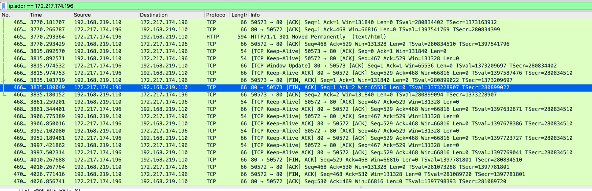

- 먼저 `3-Way Hand Shake` 과정을 수행합니다.
    - Client(Source Port) 에서 Server(Destination Port)로 통신을 원한다는 신호를 보냅니다. [SYN] Seq = 0
    - Server에서 SYN을 정상적으로 받았다는 신호를 보냅니다. [SYN, ACK] Seq=0 Ack=1
    - Client에서 SYN-ACK를 잘 받았다고 신호를 보냅니다. [ACK] Seq=1 Ack=1
- Client 에서 HTTP 요청을 보냅니다. [GET / HTTP/1.1]
- Server 측에서 확인 신호를 보냅니다.

### TCP 패킷 정보
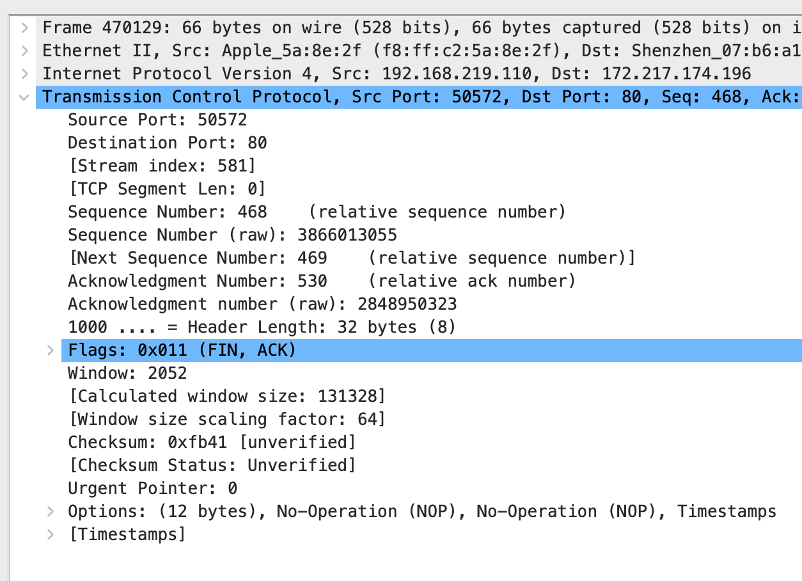

- Source Port (발신지 포트 필드) : 발신지 포트 필드는 발신지에서 오픈된 포트입니다. 위 포트를 보면 50572 포트인 것을 확인할 수 있습니다.
- Destination Port (목적지 포트 필드) : 목적지 포트 필드는 수신지에서 오픈된 포트입니다. 위의 패킷을 보면 51462 포트인 것을 확인할 수 있습니다.
- Squence Number (순차 번호 필드) : 순차번호필드는 고유한 번호를 가지며, 이 값으로 TCP 세그먼트에 대한 식별값을 제공하며, 통신 스트림일부가 분실되면 확인을 위해 수신자를 사용가능하게 합니다. 이 순차번호는 패킷에 포함되어 있는 데이터 만큼 증가하게 됩니다.
- Acknowledgement Number (확인 응답 번호 필드) : 확인 응답 번호 필드는 다음번에 기대되는 순차번호를 표시합니다. ack number에 관련하여 530의 값을 가지게 됩니다.
- Header Length (데이터 오프셋 필드) : 데이터 오프셋필드는 TCP헤더의 길이를 정의합니다. 길이는 4byte씩 증가되고, 이 필드의 값이 20이면 80바이트 길이를 갖는다는 것입니다.

---

> telnet 명령을 통해 [http://www.google.com/](http://www.google.com/) URL에 HTTP 요청을 날려 보세요.
- 어떤 헤더들이 있나요?
- 그 헤더들은 어떤 역할을 하나요?

```
Trying 108.177.97.103...
Connected to www.google.com.
Escape character is '^]'.
GET / HTTP/1.1

HTTP/1.1 200 OK
Date: Thu, 04 Feb 2021 05:34:47 GMT
Expires: -1
Cache-Control: private, max-age=0
Content-Type: text/html; charset=ISO-8859-1
P3P: CP="This is not a P3P policy! See g.co/p3phelp for more info."
Server: gws
X-XSS-Protection: 0
X-Frame-Options: SAMEORIGIN
Set-Cookie: 1P_JAR=2021-02-04-05; expires=Sat, 06-Mar-2021 05:34:47 GMT; path=/; domain=.google.com; Secure
Set-Cookie: NID=208=gX8nt2mkFX74bpfjWdJO2Go_oz6GRdJkhGzSoLtANLrmF16RAXMrLt0ER8F1ZHJnQjLXms-Y26-CDURg3rMHgfPPQtxSRaKxY01olVECwPE5TPajzYVGQvvdwqofOdATZtfPNlG2AOdc-wDvZ5iKl_FyOdeskzGr_Es6nv0-Wg0; expires=Fri, 06-Aug-2021 05:34:47 GMT; path=/; domain=.google.com; HttpOnly
Accept-Ranges: none
Vary: Accept-Encoding
Transfer-Encoding: chunked
```

### 헤더의 역할

- Date : HTTP 메세지 생성 일자
- Connection : Server / Clinet 간의 연결 옵션
- Cache-Control : 쿠키/캐시 관련 정보
- Content - Type : 미디어 타입 정보
- Expires : 리소스가 지정된 일시까지 유효함을 나타냄.
- Server : 서버의 정보
- X-XSS-Protection  : 특정 브라우저에서 제공하는 기능, XSS공격을 감지 할 때 페이지 로드를 중지 시킬 수 있음
- X-Frame-Options : 해당 페이지를 `<frame>` 또는 `<iframe>` , `<object>` 에서 렌더링 할 수 있는지 여부를 나타내는데 사용 됨
- Set-Cookie : 서버측에서 클라이언트측으로부터 세션 쿠기 정보를 설정 함
- Accept-Ranges : 부분 요청에 지원을 알리기 위해 서버에 의해 사용되는 표식. 이 헤더가 존재하면 브라우저는 처음부터 다시 다운로드를 시작하지 않고, 중단된 다운롣를 재개하려고 함.
- Vary : 캐시 된 응답을 향후 요청들에서 오리진 서버로 새로운 요청 헤더를 요청하는 대신 사용할 수 있는지 여부를 결정함.
- Tranfer-Encoding : 사용자에게 entitiy를 안전하게 전송하기 위해 사용하는 인코딩 형식을 지정함.

# 보완 내용

- IP에서 라우팅 할 때, 3개의 라우터가 A→B→C→A→B→ .. 이렇게 서로 순환 라우팅을 할 때는 어떻게 될까요?
- traceroute의 작동 원리는 어떻게 될까요?
- IP는 패킷이 사라지거나 전송 순서가 바뀔 수 있는데, TCP는 이걸 어떻게 해결 할까요?

# Answers

> IP에서 라우팅 할 때, 각 라우터가 서로 순환 라우팅을 할 떄는 어떻게 될까요?

## Routing Protocol

먼저 라우팅 프로토콜에 대해서 학습하겠습니다.

인터넷이란 여러네트워크로 구성되어 있고 그 네트워크는 여러개의 네트워크 장비로 이루어져 있습니다.

라우팅은 여기에서 송신지에서 목적지로 가는 여러개의 경로중에 어느 하나를 선택하는 것이 라우팅입니다. 실제적으론 통신장치나 송신측이나 라우팅 테이블에 의해서 일어납니다.

라우팅 테이블에는 목적지로 가려면 여기로 가면좋다. 얘 한테 보내라 라는게 표시가 되어있습니다. 결국에는 라우팅 프로토콜은 라우팅 테이블은 만드는 것이 주요 임무이고, 라우팅에서는 라우팅 테이블을 보는것이 핵심적인 일입니다.

라우팅 프로토콜은 내부 게이트웨이 프로토콜과 외부 게이트웨이 프로토콜로 나뉩니다.

내부 게이트웨이 프로토콜과 외부게이트웨이 프로토콜은 AS(Autonomous System)으로 구분됩니다. 이 AS내부냐, AS간이냐가 내부 인지 외부인지 기준이 됩니다.

내부 게이트웨이 프로토콜에는 IS-IS, OSPF, IGRP, EIGRP, RIP 등이 이에 속합니다.

외부 게이트웨이 프로토콜에는 IBGP가 이에 속합니다.

### 자율 시스템

같은 회사의 있는 라우터들로 예를 들어보면 라우팅 테이블들을 만드는 것인데, 라우팅 테이블을 만들땐 라우팅 정보를 수집합니다. 라우팅 정보를 수집을 할때 인터넷에 있는 모든 라우터들로부터 정보를 수집하지 않습니다.

거꾸로 얘기하면 다른회사 다른 네트워크에 대한 장비들과 교환을 할까? 당연히 그렇지 않습니다. 회사 내에 있는, 기관 내에 있는 통신장비들 끼리만 라우팅 정보를 주고받아서 라우팅 테이블을 만들어야 합니다.

그래서 어떤 부분까지, 영역까지 라우팅 정보를 주고 받을것이냐 정하게 되는데 이것을 바로 AS라고 합니다.

**자율 시스템 특징**
통신 장치들과 네트워크의 전체 집합체. 즉 AS는 하나의 기관 내부를 나타내는 것으로 네트워크와 라우터의 집합으로 구성됩니다.
인터넷은 여러 기관의 네트워크로 구성되며, 각 기관은 하나의 AS로 볼 수 있습니다.

IGP (내부 게이트웨이 프로토콜)은 같은 AS 내부에서 라우팅 정보를 주고 받을때 사용되는 프로토콜이며,

BGP (외부 게이트웨이 프로토콜) 다른 회사, 다른 기관 등의 AS간에 라우팅 정보를 주고 받을떄 사용되는 프로토콜입니다.

> 라우팅 입장에서 보게 되면, 인터넷은 여러 개의 AS들이 서로 연결 되어 있는 집합체입니며, AS는 라우팅 정보를 주고받을 수 있는 영역입니다.

자율 시스템의 특징중에 하나는, 각 AS는 하나 또는 여러 개의 라우팅 프로토콜을 사용할 수 있습니다. 하지만 AS간에는 하나의 라우팅 프로토콜만 사용할 수 있습니다.

### Intradomain (AS 내에서)

- Distance Vector Algorithm (RIP)
- Link State Algorithm (OSPF)

### Interdomain (AS 간에)

- Path Vactor Algorithm (BGP)

## Distance Vector Routing

거리 벡터 라우팅에서 두 노드 사이의 최소 비용 경로의 최소 거리를 갖는 경로이며, 경로를 계산하기 위해 **Bellman-ford Algorithm**을 사용 합니다.

Distance Vector Routing을 사용하는 실제 라우팅 프로토콜들은 BRIPv1/v2, IGRP(Interior Gatewat Routing Protocol)이 있으며, BGP(Border Gateway Protocol)도 거리 벡터 라우팅과 개념 상 유사

### 알고리즘의 동작

- 전체 AS에 대한 정보를 공유한다.
- 이웃 라우터하고만 공유한다.
- 주기적으로 공유한다.

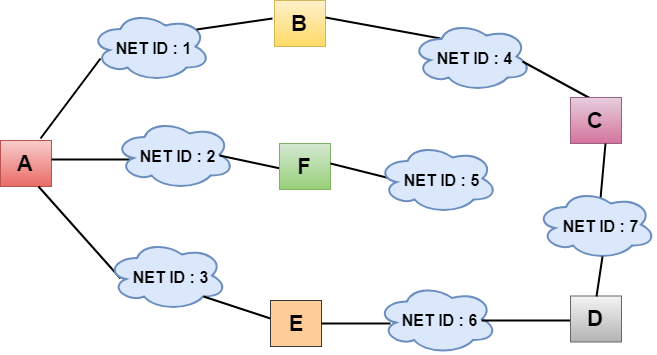

A라는 라우터는 네트워크 1, 2, 3 이 연결되어 있습니다. A와 연결되어 있는 라우터는 B, F, E라우터한테 주기적으로 보내줍니다. 즉, 내가 알고있는 전체 네트워크에 대한 정보를 이웃하고 있는 라우터에게 보내줍니다.

그러면 인접 라우터는 보내준 라우터로부터 연결되어있는 네트워크의 정보를 받고 인접 라우터가 가지고 있던 정보와 합쳐서 새로운 라우팅 테이블을 만들 수 있습니다.

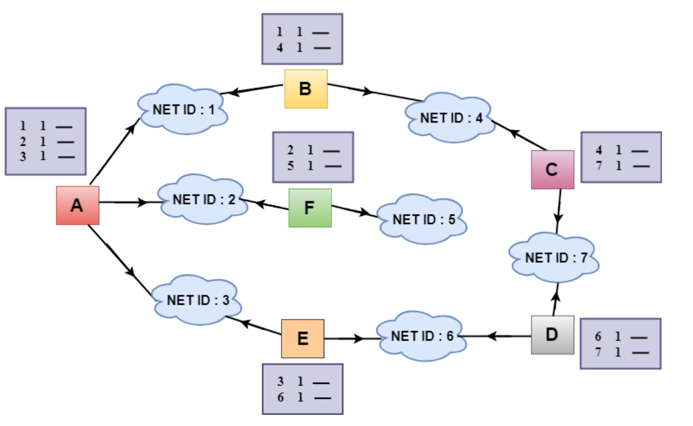

초기값은 A라는 라우터를 보면, A라는 장치가 가지고 있는 라우팅 테이블입니다.

총 엔트리는 3개가 존재하고, 목적지와 비용이 명시되어 있습니다. 이 라우팅 테이블은 이웃하는 모든 노드에게 보내집니다.

### Table Update

- A가 B로부터 라우팅 테이블을 받으면, 그 정보를 사용하여 테이블을 업데이트 합니다.
- B의 라우팅 표는 패킷이 네트워크 1과 4로 이동하는 방법을 보여줍니다.
- B는 A 라우터의 이웃으로, A에서 B까지의 패킷은 한 홉으로 도달할 수 있습니다. 따라서, 1은 B의 표에 제시된 모든 비용에 추가되며, 총액은 특정 네트워크에 도달하기 위한 비용이 될 것입니다.

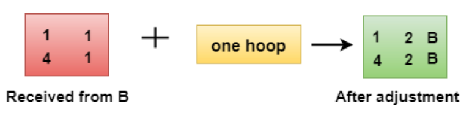

조정 후 A는 이 테이블을 자체 테이블과 결합하여 결합 테이블을 만듭니다.

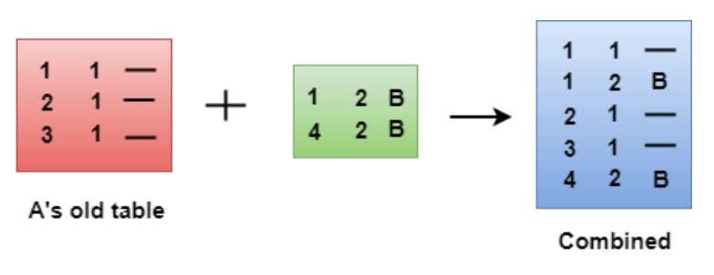

결합된 표는 일부 중복 데이터를 포함할 수 있습니다. 위 그림에서 라우터 A의 결합 테이블은 중복 데이터를 포함하고 있으므로 비용이 가장 낮은 데이터만 보관합니다.


라우팅 테이블을 생성하는 프로세스는 모든 라우터에 대해 계속 반복됩니다. 모든 라우터는 이웃으로부터 정보를 받고 라우팅 테이블을 업데이트 합니다.

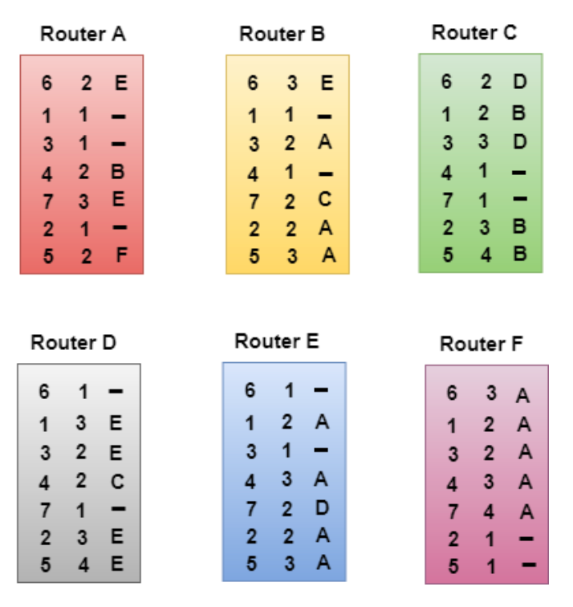

### Routing Information Protocol

거리 벡터 라우팅 방법을 사용하며 라우팅 테이블에서 목적지는 일반적으로 네트워크가 되는프로토콜, 사용되는 매트릭은 홉수로 합니다. 도달 불가는한 경우 메트릭의 값을 16으로 정해놓습니다. 이웃 노드는 라우터의 주소가 됩니다.

RIP 프로토콜을 사용하여 테이블을 만들 수 있으며 Distance Vector Routing 방법을 사용합니다.

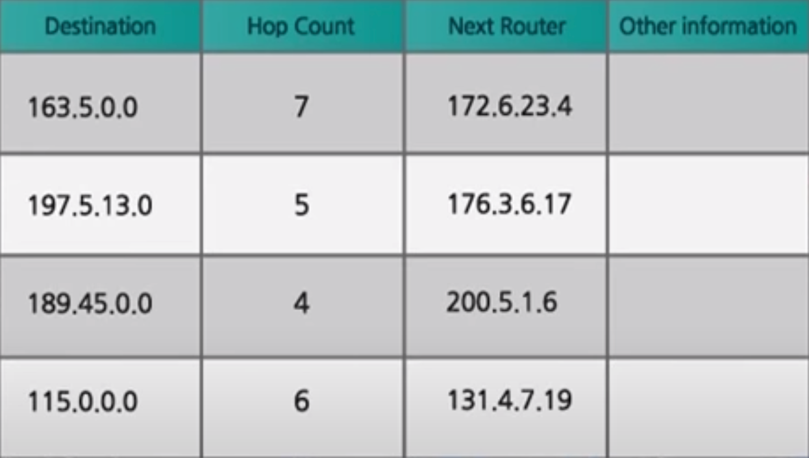

## Link State Routing

링크 상태 라우팅에서는 모든 노드가 전체 네트워크에 대한 구성도를 만들어서 경로를 구합니다.

각 노드는 다른 모든 노도로의 최단 경로를 구합니다. 각 노드는 Dijkstra's 최단 경로 알고리즘을 사용하여 라우팅 테이블을 구축합니다.

이 알고리즘을 실제로 사용하는 프로토콜은 Open Shortest Path Fist(OSPF) 이 있습니다.

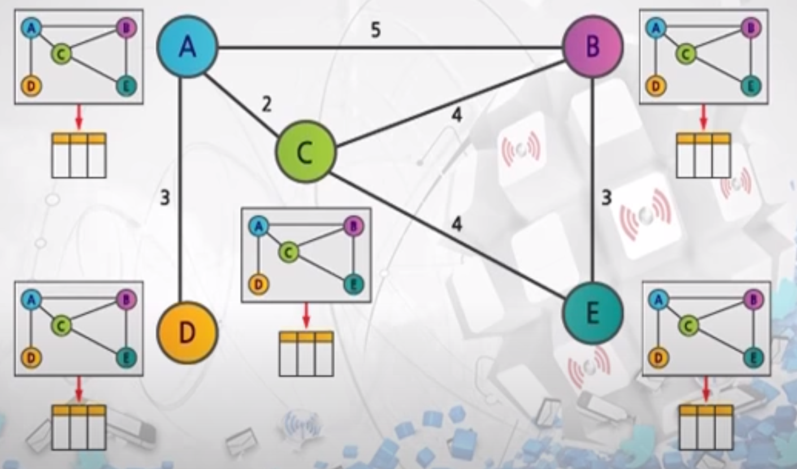

위 그림을 보면 각각의 라우터들이 구성도를 모두 그립니다. 구성도를 모두 다 그린 다음에 거기서 최단경로를 구하는 방법으로 진행됩니다.

구성도를 구하는 방법은 각 노드의 부분 정보를 모아서 전체 네트워크의 구성도를 구할 수 있습니다.

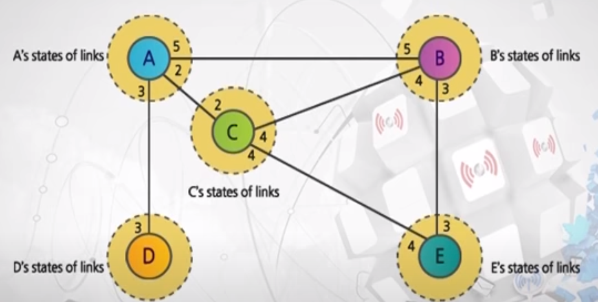

인접 노드와 관련된 정보를 전체 라우터한테 전부 다 공유합니다. 변화가 발생하면 다시 정보를 공유하는 방식으로 동작됩니다.

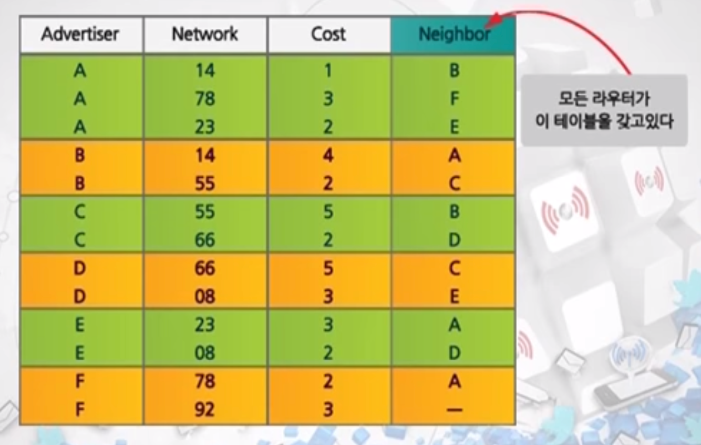

위 테이블을 '링크 상태 테이블' 이라고 합니다. 이 링크 상태 테이블을 가지고 전체 구성도를 그릴 수 있습니다.

## Path Vector Routing (BGP)

이 방법은 AS간에 사용되는 라우팅 프로토콜로 현재 사용되는 버전은 BGP4입니다.

목적지 네트워크, 이웃 라우터, 경로로 구성된 테이블을 사용합니다. 경로속성에는 모든 경로가 명시되어 있습니다.

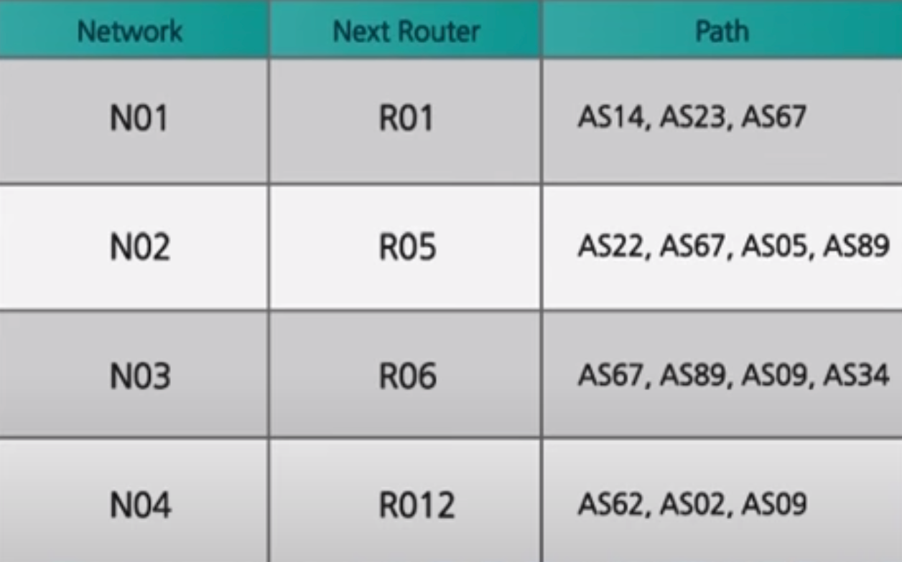

### BGP의 특징

- EGP 또는 Interdomain Routing Protocol이라고도 함
- 인터넷을 AS간 연결 경로로 이루어진 방향성 그래프의 집단으로 봄
  - BGP는 인터넷을 각각 유일한 AS번호를 갖는 AS들이 임의로 연결된 AS 집합으로 그래프를 그리고 있다고 가정
- 발전된 형태의 Distance Vector Routing Protocol
  - 'Path Vector Routing Protocol 이라고도 불림
- 끝 없이 순환되는 문제점이 없도록 함
  - BGP는 RIP와 같은 거리값에 기본한 라우팅 알고리즘이지만, 목적지까지의 경로값을 전송하는 것이 아니고, 목적지까지 도달하는데 경유하는 AS의 순서를 전송. 즉, BGP는 Looping-Free하는 라우팅을 보장하며, 순환을 피할 수 있도록 목적지까지 가는 경로 정보를 제공

> traceroute의 작동 원리는 어떻게 될까요?

Traceroute의 작동 원리는 `ICMP` 방식으로 이루어 집니다.

Traceroute는 `ICMP` 의 type30으로써, TTL(Time to live) 방식을 사용합니다.

여기서 TTL은 컴퓨터나 네트워크에서 데이터의 유효기간을 나타내기 위한 방법입니다. TTL은 계수기나 타임스탬프의 형태로 데이터에 포함되며, 정해진 유효기간이 지나면 데이터는 폐기됩니다. 컴퓨터 네트워크에서 TTL은 패킷의 무한 순환을 방지하는 역할을 합니다.

여기서 사용되는 TTL은 내가 이동할 수 있는 최대 라우팅 홉을 의미합니다.

예를 들어 TTL을 1로 설정하고 패킷을 보내면, 다음 라우터에서 바로 TTL이 0이 되면서 Error를 반환합니다.

`ICMP` traceroute는 TTL을 1로 시작해서 보내고, 목표 라우터에 도달할 때까지 TTL을 1씩 계속 늘려가며 패킷을 보냅니다. 그러면 가능 경로에 있는 모든 라우터들은 TTL 0 을 경험하기 때문에 `ICMP` Error를 통해 본인의 라우팅 IP를 반환합니다.

간단하게 정리하면

1. TTL을 1로 패킷을 전송합니다,
2. TTL이 0이된 바로 다음 라우터는 ICMP error 메세지를 돌려줍니다. (경로 상에 있는 첫번째 라우터 IP를 알아냅니다.)
3. TTL을 2로 패킷을 전송합니다.
4. TTL이 0이된 경로중 2번째에 있는 라우터는 ICMP error 메세지를 돌려줍니다. (경로 상에 있는 두번째 라우터 IP를 알아냅니다.)
5. 위와 같은 방식으로 도착할 때 까지 모든 TTL을 늘려가며 전송합니다.
6. 목적지의 `ICMP` 메세지를 받으면 , 라우팅 경로의 모든 IP를 알 수 있습니다.

> IP는 패킷이 사라지거나 전송 순서가 바뀔 수 있는데, TCP는 이걸 어떻게 해결 할까요?

## TCP의 재전송과 타임 아웃

TCP는 그 특성상 자신이 보낸 데이터에 대해서 상대방이 받았다는 의미의 응답 패킷을 다시 받아야 통신이 정상적으로 이뤄졌다고 생각한다.

그래서 만약 자신이 보낸 데이터에 대한 응답 패킷을 받지 못하면 패킷이 유실되었다고 판단하고 보냈던 패킷을 다시한번 보냅니다.

이 과정을 TCP 재전송 이라고 합니다.

TCP 재전송은 보냈던 패킷을 다시한번 보내기 때문에 네트워크 성능에 저하를 가져올 수밖에 없지만, TCP통신의 특성상 반드시 필요한 과정입니다.

이러한 TCP 재전송은 생각보다 자주 일어날 수 있으며, 이를 대비할 수 있는 예외 처리를 해두는 것이 서비스 품질 유지에 도움이 됩니다.

### TCP 재전송과 RTO

TCP는 흔히 신뢰성있는 연결이라고 합니다.

'신뢰성 있는' 이라는 표현을 통해 알 수 있는 것처럼 UDP와는 다르게 데이터를 주고 받는 두 종단 간에 데이터를 주고 받음이 확실해야 합니다.

보낸 쪽에서는 내가 보낸 데이터를 상대방이 받았다는 응답을 보내야만 나머지를 보낼 수 있습니다.

이를 통해서 TCP를 통해 주고 받은 데이터는 정확한 데이터라고 확신하게 됩니다.

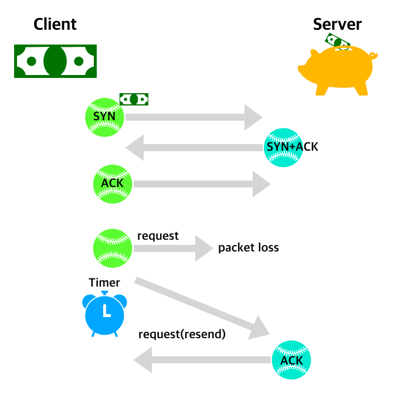

위 그림을 보면, 3Way Hand Shake 과정 이후에 송신지 측에서 보낸 Request의 Packet이 유실되어 Time Out이 발생되고, 재 전송을 하며 수신지에서 받았다는 응답을 보내줍니다.

### 어떻게 수신자는 TCP Segment에 오류가 있는지 알 수 있나요?

이를 확인하기에 앞서 TCP Segment의 Header 부분을 볼 필요가 있습니다.

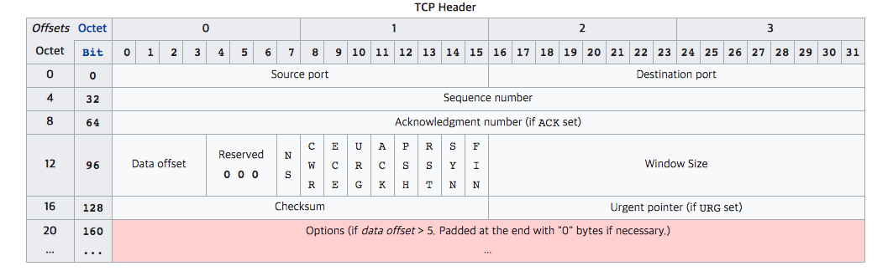

위 TCP Header에서 오류를 체크하는 부분은 128비트 부터 시작하는 `Checksum` 부분입니다. 이 Checksum Error Detecting을 통해 수신자는 송신자가 보낸 데이터가 제대로 보내졌는지 확인 할 수 있으며 잘못보내졌을 경우 위 TCP Flag 중에서 ACK Flag를 reset(0)하여 보냅니다. 제대로 보내졌을 경우에는 ACK Flag를 set(1)하고 Acknowlegment number에 수신자가 받았던 sequence number에 1을 더한 sequence number+1의 값을 넣어서 보내줍니다.

### 순서가 뒤바뀐 TCP Segment는 어떻게 처리하나요?

순서가 뒤바뀐 TCP도 전혀 문제가 되지 않습니다. 왜냐하면 Sequence number가 있기 때문에 수신자 측에서 이러한 Sequence number순서대로 데이터 청크(Data chunks)들을 잘 붙여주기만 하면 되기 때문입니다.

### 만약 수신자가 송신자에게 ACK, NAK도 못 보낼 상황이라면?

이러한 경우에는 `timeout` 개념을 사용합니다. 일정 시간동안 ACK또는 NAK가 오지 않는다면 timeout된 시점에서 다시 TCP Segment를 보내주게 됩니다. timeout 주기를 너무 길게 생성하면 퍼포먼스의 하락을 가져오고 너무 짧게 설정해도 계속 다시 쓰기 떄문에 역시 퍼포먼스의 하락을 가져옵니다.

최근 추이에 따라 `RTO(Retransmission Time Out)` 을 사용하여 타이머의 작동 시간을 가져옵니다.