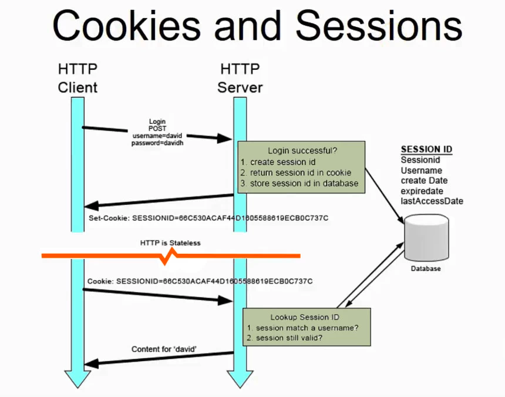
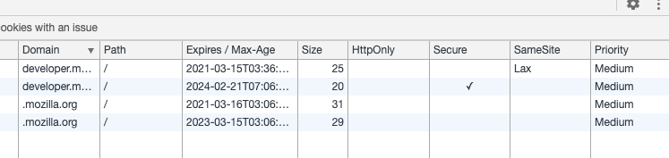
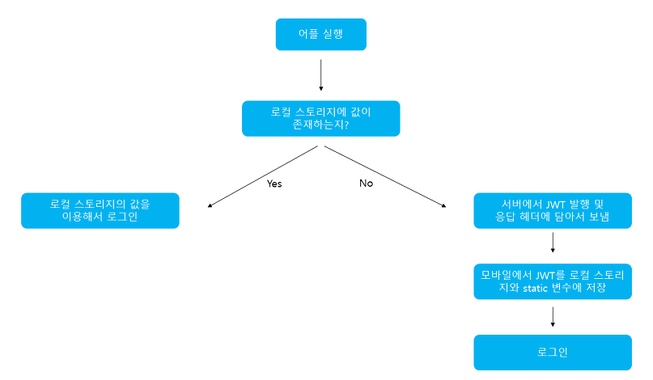
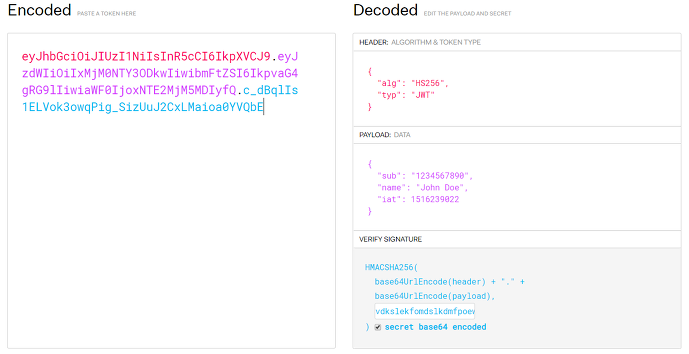
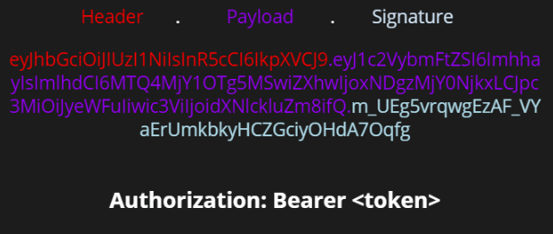

---

# Question

- 쿠키란 무엇일까요?
    - 쿠키는 어떤 식으로 동작하나요?
    - 쿠키는 어떤 식으로 서버와 클라이언트 사이에 정보를 주고받나요?
- 웹 어플리케이션의 세션이란 무엇일까요?
    - 세션의 내용은 어디에, 어떤 식으로 저장되나요?

# Answers

> 쿠키란 무엇일까요?
- 쿠키는 어떤 식으로 동작하나요?
- 쿠키는 어떤 식으로 서버와 클라이언트 사이에 정보를 주고받나요?

# 쿠키와 세션을 사용하는 이유

쿠키와 세션을 사용하는 이유는 HTTP 프로토콜의 특징이자 약점을 보완하기 위해 사용합니다. HTTP 프로토콜에는 여러가지 특징이 있는데요, 그 중에 단점으로 꼽히는 대표적인 두가지가 있습니다.

## HTTP 프로토콜의 특징

### 비연결지향(Connectionless)

- HTTP는 클라이언트가 요청(Request)을 서버에 보내고, 서버는 클라이언트에게 적절한 응답(Response)을 주고 연결을 끊는 특성이 있습니다.
    - HTTP1.1 버전에서는 커넥션을 계속 유지하고 요청(Request)에 재활용하는 기능이 추가되었습니다. HTTP Header에 `Keep-alive` 옵션을 주어 커넥션을 재활용하게 합니다. HTTP1.1 버전에서는 디폴트(Default) 옵션입니다.

### 상태없음(Stateless)

- 커넥션을 끊는 순간 클라이언트와 서버의 통신이 끝나며 상태 정보는 유지하지 않는 특성이 있습니다.

HTTP는 이 두가지 특성을 보완하기 위해서 쿠키와 세션을 사용하게 되었습니다.

비연결지향이라는 특성 덕분에 계속해서 커넥션을 유지하지 않고, 때문에 서버 리소스 낭비가 줄어드는 것은 아주 큰 장점이지만, 통신할 때마다 새로 커넥션을 만들기 때문에 클라이언트 측면에서는 상태유지를 위해 통신할 때마다 어떤 절차를 가져야 하는 단점이 생깁니다.

만약에 쿠키와 세션이 없다면 어떤 페이지에서 다른 어떤 페이지로 넘어갈 때마다 인증을 다시 받아야 하는 것입니다.

# 쿠키란?

쿠키란, 하이퍼 텍스트 기록서의 일종으로서, 인터넷 사용자가 어떠한 웹 사이트를 방문할 경우 그 사이트가 사용하고 있는 서버를 통해 인터넷 사용자의 컴퓨터에 설치되는 작은 기록 정보 파일을 의미합니다.

쿠키는 HTTP 쿠키, 웹 쿠기, 브라우저 쿠키 등 다양한 이름으로도 불립니다. 이 기록 파일에 담긴 정보는 인터넷 사용자가 같은 웹사이트를 방무할 때마다 읽히고 수시로 새로운 정보로 바뀝니다.

쿠키는 클라이언트에 저장되는 키와 값(Key : Value)이 들어있는 작은 데이터 파일입니다.

쿠키는  서버에서 `HTTP Reponse Header` 에 `Set-Cookie` 속성을 이용하여 클라이언트에 쿠키를 제공합니다.

쿠키에는 이름, 값, 만료 날짜 / 시간(쿠키 저장기간), 경로 정보 등이 들어있으며, 클라이언트의 상태 정보를 로컬에 저장했다가 요청할 때 참조됩니다.

쿠키는 서버 측에서 만료 날짜/시간을 지정하여 정해진 시간동안 데이터를 유지할 수 있습니다. 이는 보통 로그인 상태 유지에 활용됩니다.

## 세션 쿠키(Session Cookie)와 지속 쿠키(Persistent Cookie)

> 세션 쿠키 : 만료 날짜/시간 을 지정하는 쿠키
지속 쿠키 : 만료 날짜/시간을 지정하지 않는 쿠키 (항상 유지하라는 것으로 판단)

세션 쿠키는 브라우저 메모리에 저장됩니다. 브라우저가 종료되면 쿠키는 사라지게 됩니다.

지속 쿠키는 파일로 저장되므로 브라우저가 종료되어도 쿠키는 남아있게 됩니다.

여기서 세션 쿠키의 값은 브라우저의 메모리에 저장되기 때문에 보안 관리에 유리합니다. 하지만 일반 파일로 저장되는 지속 쿠키의 경우 비교적으로 보안에 취약하다고 합니다.

## 쿠키의 동작 과정



1. 클라이언트가 서버로 자원을 요청합니다.
2. 서버에서 쿠키를 생성합니다.
3. HTTP 헤더에 쿠키를 포함시켜 응답합니다.
4. 브라우저가 종료되어도 쿠키 만료 기간이 있다면 클라이언트에서 보관하고 있습니다.
5. 같은 요청을 할 경우 HTTP 헤더에 쿠키를 함께 보냅니다.
6. 서버에서 쿠키를 읽어 이전 상태 정보를 변경 할 필요가 있을 때 쿠키를 업데이트 하여 변경된 쿠키를 HTTP 헤더에 포함시켜 응답합니다.

---

> 웹 어플리케이션의 세션이란 무엇일까요?
- 세션의 내용은 어디에, 어떤 식으로 저장되나요?

# 세션이란?

서버에 클라이언트의 상태 정보를 저장하는 기술로 논리적인 연결을 세션이라고 합니다.

웹 서버에 클라이언트에 대한 정보를 저장하고 클라이언트에게는 클라이언트를 구분할 수 있는 ID를 부여하는데 이것을 `Session ID` 라고 합니다.

세션은 쿠키를 기반하고 있지만, 사용자 정보 파일을 브라우저에 저장하는 쿠키와 달리 **세션은 서버 측에서 관리합니다.** 서버에서는 클라이언트를 구분하기 위하여 세션 ID를 부여하고 웹 브라우저가 서버에 접속해서 브라우저를 종료할 때 까지 인증상태를 유지합니다. ****물론 접속 시간에 제한을 두어 일정 시간 응답이 없다면 정보가 유지되지 않게 설정이 가능합니다.

사용자에 대한 정보를 서버에 두기 때문에 쿠키보다 보안에 좋지만, 사용자가 많아질 수록 서버 메모리를 많이 차지하게 됩니다. 즉, 동시접속자 수가 많은 웹 사이트인 경우 서버에 과부하를 주게 되므로 성능 저하의 요인이 됩니다.

## 세션의 동작 방식

그림은 쿠키 동작방식의 그림을 참고해 주시기 바랍니다.

1. 클라이언트가 서버에 접속시 세션 ID를 발급 받습니다.
2. 클라이언트는 세션 ID에 대해 쿠키를 사용해서 저장하고 가지고 있습니다.
3. 클라이언트는 서버에 요청할 때, 이 쿠키의 세션 ID를 서버에 전달해서 사용합니다.
4. 서버는 세션 ID를 전달 받아서 별다른 작업없이 세션 ID로 세션에 있는 클라이언트 정보를 가져옵니다.
5. 클라이언트 정보를 가지고 서버 요청을 처리하여 클라이언트에게 응답합니다.

# 쿠키와 세션의 차이

## 저장 위치

- 쿠키는 클라이언트(브라우저)에 메모리 또는 파일에 저장하고, 세션은 서버 메모리에 저장됩니다.

## 보안

- 쿠키는 클라이언트 로컬(local)에 저장되기도 하고 특히 파일로 저장되는 경우 탈취, 변조될 위험이 있고, Request/Response 에서 스나이핑 당할 위험이 있어 보안이 비교적 취약합니다.
- 반대로 Session은 클라이언트 정보 자체는 서버에 저장되어 있으므로 비교적 안전합니다.

## Life Cycle

- 쿠키는 앞서 설명한 지속 쿠키에 경우, 브라우저를 종료하더라도 저장되어 있을 수 있는 반면, 세션은 서버에서 만료시간/날짜를 정해서 지워버릴 수 있기도 하고, 세션 쿠키에 세션 아이디를 정한 경우, 브라우저 종료시 세션 아이디가 날아갈 수 있습니다.

## 속도

- 쿠키에 정보가 있기 때문에 서버에 요청시 헤더를 바로 참조하면 되므로 속도에서 유리합니다.
- 세션은 제공받은 세션아이디를 이용해서 서버에서 다시 데이터를 참조해야 하므로 속도가 비교적 느릴 수 있습니다.

# 보완 내용

- 쿠키 옵션에는 어떤것이 있나요?
- JWT는 무엇인가요?

> 쿠키 옵션에는 어떤것이 있나요?

## 쿠키 옵션



### Domain

쿠키가 적용되어야 하는 호스트를 지정합니다. 지정되어 있지 않으면 현재 문서 URI를 기준으로 적용되지만, 서브 도메인은 포함되지 않습니다. 이전의 설계와 달리, 도메인의 선두에 위치한 점들은 무시됩니다. 만약 도메인이 지정되어 있다면 서브 도메인들은 항상 포함됩니다.

### Path

쿠키 헤더를 보내기 전에 요청 된 리소스에 있어야 하는 URL 경로를  나타냅니다. 예를 들어 특정 경로에서만 쿠키가 활성화 되기를 원한다면 `Path` 옵션을 사용할 수 있습니다.

### Expires

HTTP 타임스탬프로 기록된 쿠키의 최대 생존 시간입니다. 보통의 경우 시간으로 입력하며, 이 옵션이 지정되지 않는다면 `세션 쿠키` 로 지정되어 취급됩니다. 이는 곧 클라이언트가 종료될 때 파기 되는 것을 의미합니다.

하지만 세션이라는 기능(모든 탭을 기억했다가 브라우저를 다시 켜면 복구되는 기능 등)을 이용하여 기능을 구현하며, 이 기능으로 쿠키 또한 함께 복원됩니다.

### HttpOnly

`HttpOnly` 는 웹 브라우저와 서버가 통신할 때에만 쿠키를 발행합니다. 예를 들어 자바스크립트를 이용하여 쿠키를 훔치는 등의 방법을 방지하기 위하여 존재하는 옵션입니다.

### Secure

`Secure` 옵션을 적용하면, `HTTPS` 프로토콜을 사용할 때에만 전송됩니다. `HTTP` 를 사용하는 웹에서 `Secure` 옵션을 적용하고 `Request` 헤더를 참고해보면, `Secure` 옵션이 적용된 쿠키는 활성화 되지 않은 것을 확인할 수있습니다.

### SameSite

서버가 사이트 간 요청과 함께 쿠키를 보내서는 안 된다고 주장할 수 있습니다. 이는 사이트 간 요청 위조 공격에 대한 일부 보호 기능을 제공합니다.(CSRF) 말 그래도 `SameSite` 옵션은 쿠키가 `Cross-Site` 의 요청과 함께 전달되지 않음을 요구하는 방식입니다.

> JWT는 무엇인가요?

# JWT(Json Web Token)

## JWT 개념

`JWT(Json Web Token)` 란, Json 포맷을 이용하여 사용자에 대한 속성을 저장하는 Claim 기반의 Web Token 입니다. `JWT` 는 토큰 자체를 정보로 사용하는 `Self-Contained` 방식으로 정보를 안전하게 전달합니다. 주로 회원 인증이나 정보 전달에 사용되는 JWT는 아래의 로직을 따라서 처리됩니다.



애플리케이션이 실행될 때, JWT를 static 변수와 로컬 스토리지에 저장하게 됩니다. static 변수에 저장되는 이유는 `HTTP` 통신을 할 때마다 `JWT` 를 `HTTP` 헤더에 담아서 보내야 하는데, 이를 로컬 스토리지에서 계속 불러오면 오버헤드가 발생하기 때문입니다.

클라이언트에서 `JWT` 를 포함해 요청을 보내면 서버는 허가된 `JWT` 인지를 검사합니다. 또한 로그아웃을 할 경우 로컬 스토리지에 저장된 `JWT` 데이터를 제거합니다. (실제 서비스의 경우에는 로그아웃 시에 사용했던 토큰을 `blacklist` 라는 DB 테이블에 넣어 해당 토큰의 접근을 막는 작업을 해주어야 합니다.)

## JWT 구조

`JWT` 는 `Header`, `Payload`, `Signature` 의 3부분으로 이루어지며, `Json` 형태인 각 부분은 `Base64` 로 인코딩 되어 표현됩니다. 또한 각각의 부분을 이어 주기 위해, 구분자를 사용하여 구분합니다.

추가로, `Base64` 는 **암호화된 문자열이 아니고, 같은 문자열에 대해 항상 같은 인코딩 문자열을 반환합니다.**



### 1. HEADER

토큰의 헤더는 `typ` 과 `alg` 두 가지 정보로 구성됩니다. `alg` 는, 헤더를 암호화 하는 것이 아니고, `Signature` 를 해싱하기 위한 알고리즘을 지정하는 것입니다.

- `typ` : 토큰의 타입을 지정 ex) JWT
- `alg` : 알고리즘 방식을 지정하며, 서명(Signature) 및 토큰 검증에 사용

### 2. PAYLOAD

토큰의 페이로드에는 토큰에서 사용할 정보들의 조각들인 클레임(Claim) 이 담겨 있습니다. 클레임은 총 3가지로 나누어지며 `JSON` 형태로 다수의 정보를 넣을 수 있습니다.

**2-1. 등록된 클레임(Registered Claim)**

등록된 클레임은 토큰 정보를 표현하기 위해 이미 정해진 종류의 데이터들로, 모두 선택적으로 작성이 가능하며, 사용할 것을 권장합니다. 또한 `JWT` 를 간결하게 하기 위해 key는 모두 길이 3의 `String` 입니다. 여기서 `subject` 로는 unique 한 값을 사용하는데, 사용자 이메일을 주로 사용합니다.

- iss: 토큰 발급자(issuer)
- sub: 토큰 제목(subject)
- aud: 토큰 대상자(audience)
- exp: 토큰 만료 시간(expiration), NumericDate 형식으로 되어 있어야 함 ex) 1480849147370
- nbf: 토큰 활성 날짜(not before), 이 날이 지나기 전의 토큰은 활성화되지 않음
- iat: 토큰 발급 시간(issued at), 토큰 발급 이후의 경과 시간을 알 수 있음
- jti: JWT 토큰 식별자(JWT ID), 중복 방지를 위해 사용하며, 일회용 토큰(Access Token) 등에 사용

**2-2. 공개 클레임(Public Claim)**

공개 클레임은 사용자 정의 클레임으로, 공개용 정보를 위해 사용됩니다. 충돌 방지를 위해 URI 포맷을 사용하며, 예시는 아래와 같습니다.

```jsx
{"https://yunmin.tistory.com":true}
```

**2-3. 비공개 클레임(Private Claim)**

비공개 클레임도 공개 클레임과 마찬가지로 사용자 정의 클레임입니다. 서버와 클라이언트 사이에 임의로 지정한 정보를 저장합니다. 아래 예시와 같습니다.

```jsx
{"token_type":access}
```

### 3. Signature

`Signature` 는 토큰을 인코딩하거나 유효성 검증을 할 때 사용하는 고유한 암호화 코드입니다. 이는 위에서 만든 `Header` 와 `Payload` 의 값을 각각 `Base64` 로 인코딩하고, 인코딩한 값을 비밀 키를 이용해 `Header` 에서 정의한 알고리즘으로 해싱을 하고 이 값을 다시 `Base64` 로 인코딩하여 생성합니다.

## JWT 토큰 예시

애리는 생성된 `JWT` 의 예시입니다.



생성된 토큰은 `HTTP` 통신을 할 때 `Autorization` 이라는 key의 value로 사용됩니다. 일반적으로 value에는 Bearer이 앞에 붙여 집니다.

```jsx
{ 
 "Authorization": "Bearer {생성된 토큰 값}",
}
```

## JWT의 단점 및 고려사항

- **Self-contained :** 토큰 자체에 정보를 담고 있으므로 양날의 검이 될 수 있습니다.
- Token Length ****: 토큰의 페이로드(Payload)에 3종류의 클레임을 저장하기 때문에, 정보가 많아질수록 토큰의 길이가 늘어나 네트워크에 부하를 줄 수 있습니다.
- **Payload 인코딩** : 페이로드(Payload) 자체는 암호화 된 것이 아니라, BASE64로 인코딩 된 것입니다. 중간에 Payload를 탈취하여 디코딩하면 데이터를 볼 수 있으므로, 암호화하거나 Payload에 중요 데이터를 넣지 않아야 합니다.
- **Stateless** : JWT는 상태를 저장하지 않기 때문에 한번 만들어지면 제어가 불가능합니다. 즉, 토큰을 임의로 삭제하는 것이 불가능하므로 토큰 만료 시간을 꼭 넣어주어야 합니다.
- **Tore Token** : 토큰은 클라이언트 측에서 관리해야 하기 때문에, 토큰을 저장해야 합니다.