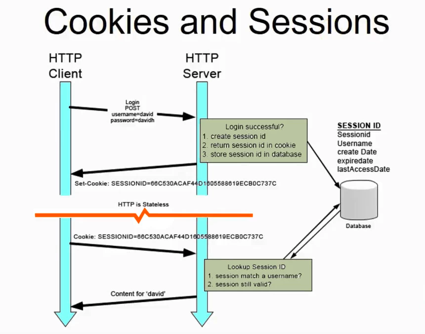

---

# Question

- 쿠키란 무엇일까요?
    - 쿠키는 어떤 식으로 동작하나요?
    - 쿠키는 어떤 식으로 서버와 클라이언트 사이에 정보를 주고받나요?
- 웹 어플리케이션의 세션이란 무엇일까요?
    - 세션의 내용은 어디에, 어떤 식으로 저장되나요?

# Answers

> 쿠키란 무엇일까요?
- 쿠키는 어떤 식으로 동작하나요?
- 쿠키는 어떤 식으로 서버와 클라이언트 사이에 정보를 주고받나요?

# 쿠키와 세션을 사용하는 이유

쿠키와 세션을 사용하는 이유는 HTTP 프로토콜의 특징이자 약점을 보완하기 위해 사용합니다. HTTP 프로토콜에는 여러가지 특징이 있는데요, 그 중에 단점으로 꼽히는 대표적인 두가지가 있습니다.

## HTTP 프로토콜의 특징

### 비연결지향(Connectionless)

- HTTP는 클라이언트가 요청(Request)을 서버에 보내고, 서버는 클라이언트에게 적절한 응답(Response)을 주고 연결을 끊는 특성이 있습니다.
    - HTTP1.1 버전에서는 커넥션을 계속 유지하고 요청(Request)에 재활용하는 기능이 추가되었습니다. HTTP Header에 `Keep-alive` 옵션을 주어 커넥션을 재활용하게 합니다. HTTP1.1 버전에서는 디폴트(Default) 옵션입니다.

### 상태없음(Stateless)

- 커넥션을 끊는 순간 클라이언트와 서버의 통신이 끝나며 상태 정보는 유지하지 않는 특성이 있습니다.

HTTP는 이 두가지 특성을 보완하기 위해서 쿠키와 세션을 사용하게 되었습니다.

비연결지향이라는 특성 덕분에 계속해서 커넥션을 유지하지 않고, 때문에 서버 리소스 낭비가 줄어드는 것은 아주 큰 장점이지만, 통신할 때마다 새로 커넥션을 만들기 때문에 클라이언트 측면에서는 상태유지를 위해 통신할 때마다 어떤 절차를 가져야 하는 단점이 생깁니다.

만약에 쿠키와 세션이 없다면 어떤 페이지에서 다른 어떤 페이지로 넘어갈 때마다 인증을 다시 받아야 하는 것입니다.

# 쿠키란?

쿠키란, 하이퍼 텍스트 기록서의 일종으로서, 인터넷 사용자가 어떠한 웹 사이트를 방문할 경우 그 사이트가 사용하고 있는 서버를 통해 인터넷 사용자의 컴퓨터에 설치되는 작은 기록 정보 파일을 의미합니다.

쿠키는 HTTP 쿠키, 웹 쿠기, 브라우저 쿠키 등 다양한 이름으로도 불립니다. 이 기록 파일에 담긴 정보는 인터넷 사용자가 같은 웹사이트를 방무할 때마다 읽히고 수시로 새로운 정보로 바뀝니다.

쿠키는 클라이언트에 저장되는 키와 값(Key : Value)이 들어있는 작은 데이터 파일입니다.

쿠키는  서버에서 `HTTP Reponse Header` 에 `Set-Cookie` 속성을 이용하여 클라이언트에 쿠키를 제공합니다.

쿠키에는 이름, 값, 만료 날짜 / 시간(쿠키 저장기간), 경로 정보 등이 들어있으며, 클라이언트의 상태 정보를 로컬에 저장했다가 요청할 때 참조됩니다.

쿠키는 서버 측에서 만료 날짜/시간을 지정하여 정해진 시간동안 데이터를 유지할 수 있습니다. 이는 보통 로그인 상태 유지에 활용됩니다.

## 세션 쿠키(Session Cookie)와 지속 쿠키(Persistent Cookie)

> 세션 쿠키 : 만료 날짜/시간 을 지정하는 쿠키
지속 쿠키 : 만료 날짜/시간을 지정하지 않는 쿠키 (항상 유지하라는 것으로 판단)

세션 쿠키는 브라우저 메모리에 저장됩니다. 브라우저가 종료되면 쿠키는 사라지게 됩니다.

지속 쿠키는 파일로 저장되므로 브라우저가 종료되어도 쿠키는 남아있게 됩니다.

여기서 세션 쿠키의 값은 브라우저의 메모리에 저장되기 때문에 보안 관리에 유리합니다. 하지만 일반 파일로 저장되는 지속 쿠키의 경우 비교적으로 보안에 취약하다고 합니다.

## 쿠키의 동작 과정

1. 클라이언트가 서버로 자원을 요청합니다.
2. 서버에서 쿠키를 생성합니다.
3. HTTP 헤더에 쿠키를 포함시켜 응답합니다.
4. 브라우저가 종료되어도 쿠키 만료 기간이 있다면 클라이언트에서 보관하고 있습니다.
5. 같은 요청을 할 경우 HTTP 헤더에 쿠키를 함께 보냅니다.
6. 서버에서 쿠키를 읽어 이전 상태 정보를 변경 할 필요가 있을 때 쿠키를 업데이트 하여 변경된 쿠키를 HTTP 헤더에 포함시켜 응답합니다.

---

> 웹 어플리케이션의 세션이란 무엇일까요?
- 세션의 내용은 어디에, 어떤 식으로 저장되나요?

# 세션이란?

서버에 클라이언트의 상태 정보를 저장하는 기술로 논리적인 연결을 세션이라고 합니다.

웹 서버에 클라이언트에 대한 정보를 저장하고 클라이언트에게는 클라이언트를 구분할 수 있는 ID를 부여하는데 이것을 `Session ID` 라고 합니다.

세션은 쿠키를 기반하고 있지만, 사용자 정보 파일을 브라우저에 저장하는 쿠키와 달리 **세션은 서버 측에서 관리합니다.** 서버에서는 클라이언트를 구분하기 위하여 세션 ID를 부여하고 웹 브라우저가 서버에 접속해서 브라우저를 종료할 때 까지 인증상태를 유지합니다. ****물론 접속 시간에 제한을 두어 일정 시간 응답이 없다면 정보가 유지되지 않게 설정이 가능합니다.

사용자에 대한 정보를 서버에 두기 때문에 쿠키보다 보안에 좋지만, 사용자가 많아질 수록 서버 메모리를 많이 차지하게 됩니다. 즉, 동시접속자 수가 많은 웹 사이트인 경우 서버에 과부하를 주게 되므로 성능 저하의 요인이 됩니다.

## 세션의 동작 방식

그림은 쿠키 동작방식의 그림을 참고해 주시기 바랍니다.

1. 클라이언트가 서버에 접속시 세션 ID를 발급 받습니다.
2. 클라이언트는 세션 ID에 대해 쿠키를 사용해서 저장하고 가지고 있습니다.
3. 클라이언트는 서버에 요청할 때, 이 쿠키의 세션 ID를 서버에 전달해서 사용합니다.
4. 서버는 세션 ID를 전달 받아서 별다른 작업없이 세션 ID로 세션에 있는 클라이언트 정보를 가져옵니다.
5. 클라이언트 정보를 가지고 서버 요청을 처리하여 클라이언트에게 응답합니다.

# 쿠키와 세션의 차이

## 저장 위치

- 쿠키는 클라이언트(브라우저)에 메모리 또는 파일에 저장하고, 세션은 서버 메모리에 저장됩니다.

## 보안

- 쿠키는 클라이언트 로컬(local)에 저장되기도 하고 특히 파일로 저장되는 경우 탈취, 변조될 위험이 있고, Request/Response 에서 스나이핑 당할 위험이 있어 보안이 비교적 취약합니다.
- 반대로 Session은 클라이언트 정보 자체는 서버에 저장되어 있으므로 비교적 안전합니다.

## Life Cycle

- 쿠키는 앞서 설명한 지속 쿠키에 경우, 브라우저를 종료하더라도 저장되어 있을 수 있는 반면, 세션은 서버에서 만료시간/날짜를 정해서 지워버릴 수 있기도 하고, 세션 쿠키에 세션 아이디를 정한 경우, 브라우저 종료시 세션 아이디가 날아갈 수 있습니다.

## 속도

- 쿠키에 정보가 있기 때문에 서버에 요청시 헤더를 바로 참조하면 되므로 속도에서 유리합니다.
- 세션은 제공받은 세션아이디를 이용해서 서버에서 다시 데이터를 참조해야 하므로 속도가 비교적 느릴 수 있습니다.